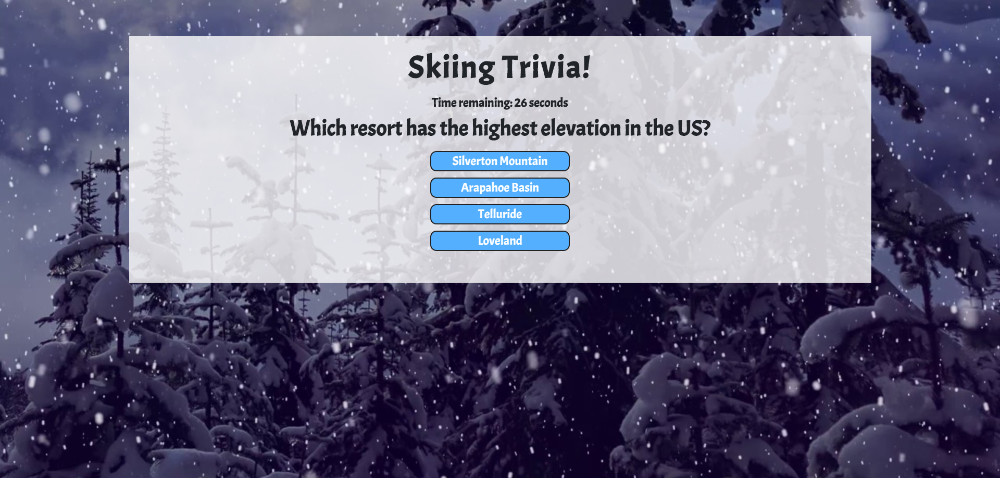

# Trivia Game

## Trivia Game built with JavaScript and jQuery!

This is a trivia game with a skiing theme. The user will click start to begin the game. Once the game is started, a question will appear with 4 options to choose from as the right answer. There is also a timer set to 30 seconds for each question. Once the user makes a guess, or if time runs out, the page will be updated with a win/loss message as well as an image of the correct answer. A new question will then appear after 5 seconds. After all the questions have been answered, the display will be updated showing the number of correct and incorrect answers as well as the number of times that the timer ran out. A play again button will also appear at this point that lets the user start the game over.

https://mattauretta.github.io/TriviaGame/

